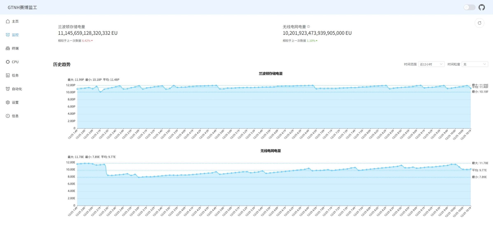

<p align="center">
  
  
</p>

<h1 align="center" style="font-size: 38px;">赛博监工</h1>
<h3 align="center">AE2 Control for GTNH 2.8.0</h3>


## 简介

该项目是一个基于[OpenComputers](https://github.com/MightyPirates/OpenComputers)的GTNH-AE2的远程控制系统，主要用于监控AE2网络、物品、流体、CPU、任务等信息，以及支持远程下单、查看任务等功能。


该项目基于[RemoteOC](https://github.com/z5882852/RemoteOC)框架开发，需要一台**可公网访问的主机**作为服务器，以及一台或多台OpenComputers电脑作为客户端。


## 功能

- 支持查看AE2网络内的物品、流体信息
- 支持查看CPU状态
- 支持远程下单
- 支持自动化流程
- 支持监控兰波顿电容的电量和无线电网电量（需配置）
- 支持监控波顿电容的电量和无线电网电量历史趋势（需配置）


## 特色

- 支持多个OC客户端
- 移动端适配
- 支持自定义任务
- 暗色模式
- 高度可定制化


## 安装

### 项目目录

```shell
client/    # OC客户端
server/    # 服务端
website/   # 网页前端
```

### 使用 Docker 一键部署前后端

1. **准备工作**

    - 安装`Docker`和`Docker Compose`
    - 下载仓库中的`docker-compose.yml`和`server/.env`文件

2. **修改配置**

    - 根据想要修改`docker-compose.yml`文件中的环境变量
    - 修改`.env`文件中的环境变量

3. **启动服务**

    ```bash
    docker-compose up -d
    ```
    > 默认前端端口为`80`，可直接访问，后端端口为`8080`，可在`docker-compose.yml`中修改
  
4. **查看日志**

    ```bash
    docker-compose logs -f
    ```

5. **停止服务**

    ```bash
    docker-compose down
    ```

### 手动构建后端 Docker 镜像


1. **准备工作**

    - 安装 `Docker`

2. **克隆源码**

   - 使用 Git 克隆项目到本地：
     ```bash
     git clone https://github.com/z5882852/RemoteOC-GTNH-AE2.git
     ```
   - 进入项目目录：
     ```bash
     cd RemoteOC-GTNH-AE2/server
     ```

3. **构建镜像**

    ```bash
    docker build -t roc-gtnh-backend .
    ```

4. **运行容器**

    ```bash
    docker run -d --name roc-gtnh-backend -p 8080:8080 roc-gtnh-backend
    ```

5. **查看日志**

    ```bash
    docker logs -f roc-gtnh-backend
    ```

### 服务器端

**服务器端需要安装在可公网访问的服务器上**

1. **准备工作**

    - 安装`Python3`和`pip`

2. **克隆源码**
   - 使用 Git 克隆项目到本地：
     ```bash
     git clone https://github.com/z5882852/RemoteOC-GTNH-AE2.git
     ```
   - 进入项目目录：
     ```bash
     cd RemoteOC-GTNH-AE2/server
     ```

3. **安装依赖**

    ```bash
    pip install -r requirements.txt
    ```

4. **修改配置**

    - 根据需要修改`.env`文件中的环境变量
    - 根据需要修改`config.py`文件中的配置

5. **运行服务**

    ```bash
    python run.py
    ```

    指定端口运行服务
    ```bash
    python run.py --port 8080
    ```

### OC客户端

**OC客户端需要安装在游戏内的OC电脑上**


1. **注意事项**

    配置要求: 
    - CPU: `T3 CPU`或`T3 APU`
    - 内存: `2 x T3.5内存` (推荐使用`T4服务器`安装`4 x T3.5内存`)
    - 扩展卡: `因特网卡`
    - 扩展: `适配器`
    - 其他: 根据实际情况调整

    当AE终端物品种类超过1000种时请使用`4 x T3.5内存`，超过2000种时请使用`创造模式内存`，否则会内存溢出导致无法获取物品数据。
    > 具体多少种没进行测试，能跑起来就行

2. **准备工作**

    - 组装好 OC 电脑
    - 安装 OpenOS 操作系统
    - 安装因特网卡
    - 连接适配器
    - 将ME接口或ME控制器紧邻适配器
    - 使用分析器获取ME接口或ME控制器的地址

3. **安装程序安装**

    - 下载安装程序
    ```bash
    wget https://raw.githubusercontent.com/z5882852/RemoteOC-GTNH-AE2/main/client/setup.lua
    ```

    - 安装客户端
    ```bash
    setup.lua
    ```

4. **直接安装(当raw.githubusercontent.com无法访问时)**

    - 下载或克隆项目至本地
    - 将`client`目录内所有文件上传至你的 OC 电脑

5. **修改`env.lua`文件**

    - 将`env.lua`中的`baseUrl`修改为你的后端地址
    - 将`env.lua`中的`serverToken`修改为你的服务端令牌
    - 将`env.lua`中的`address`修改为你的ME接口或ME控制器的地址

6. **选择扩展插件（可选）**

    - 可选插件目录为`client/optional_plugins/{插件名}`
    - 该目录下会有`lib`和`plugins`两个文件夹，分别对应插件依赖库和插件本体
    - 将插件目录下的`lib`内的文件上传至`client/lib`目录
    - 将插件目录下的`plugins`内的文件上传至`client/plugins`目录
    - 根据插件的说明修改插件本体文件


7. **运行客户端**

    输入以下命令运行客户端
    ```bash
    run.lua
    ```

    DEBUG模式运行
    ```bash
    run.lua --debug
    ```


### 网页前端

#### **1. 使用 Releases 打包好的网页并部署**
如果您希望快速部署前端，可直接使用打包好的文件，无需进行源码构建。

1. **下载 Releases 文件**
   - 访问项目的 Releases 页面：[🔗 **GitHub Releases**](https://github.com/z5882852/RemoteOC-GTNH-AE2/releases)
   - 下载最新版本的 `RemoteOC_frontend-x.x.x_GTNH-2.x.0.tar.gz` 文件（或类似文件名的构建包）。

2. **上传到服务器**
   - 将压缩包文件上传到您的服务器（如 Nginx、Apache、或者其他静态资源服务器）。
   - 解压文件。

3. **配置服务器**

4. **访问网页**
   - 使用浏览器访问部署的域名。


#### **3. 克隆源码并构建再部署**
1. **环境要求**
   - Node.js: 推荐版本 16.x 或以上
   - npm 或 yarn: 用于安装依赖
   - Git: 用于克隆项目

2. **克隆源码**
   - 使用 Git 克隆项目到本地：
     ```bash
     git clone https://github.com/z5882852/RemoteOC-GTNH-AE2.git
     ```
   - 进入项目目录：
     ```bash
     cd RemoteOC-GTNH-AE2/website
     ```

3. **安装依赖**
   - 使用 npm：
     ```bash
     npm install
     ```
   - 或使用 yarn：
     ```bash
     yarn install
     ```

4. **构建项目**
   - 运行以下命令以生成静态文件：
     ```bash
     npm run build
     ```
   - 构建完成后，静态资源将位于 `dist/` 目录中。

5. **部署静态资源**
   - 将 `dist/` 文件夹中的文件上传到您的服务器（如 Nginx、Apache 或其他静态资源服务器）。
   - 配置服务器。
   - 重启服务器后，访问您的域名即可。


#### **4. 注意事项**
- 由于项目是单页面应用程序（SPA），请确保服务器配置了路径重写规则（如 Nginx 中的 `try_files $uri /index.html`）。


## 效果图

<details>
<summary>点击展开</summary>




</details>

## 扩展插件

### 1. monitor

#### 功能
- 监控兰波顿电容的电量和无线电网电量
- 兰波顿电量和无线电网电量历史趋势

#### 准备工作
- 将适配器连接到兰波顿库电容上

#### 配置
- 修改`powerMonitor.lua`文件中代理地址为兰波顿电容库地址
- 将后端`config.py`的定时任务设置添加以下内容:
    ```Python
    timer_task_config = {
        # {...}, 其他定时任务配置
        "monitor": {
            'interval': 300,  # 间隔时间
            "client_id": "client_01",
            "commands": [
                "return getCapacitorInfo()",
            ],
            "cache": True,
            "handle": parse_data,
            "callback": None,
            "save_history": True,
            "history_days": 7,  # 历史记录最大保存天数
        },
    }
    ```
- 在网页前端的`设置`中启用监控页面

## TODO
> 以下内容为计划添加的内容，不一定全部实现，欢迎大家提交PR
- OC: 添加更多插件
- 后端: 添加更多自动化任务类型并且可配置
- 后端: 新增Redis支持，用于存储数据
- 后端: 新增OC客户端离线检测
- 前端: 自动化任务页面根据后端任务类型动态生成
- 前端: 新增页面，用于输入后端地址和令牌后才能进入

## 其他

### RemoteOC框架

[https://github.com/z5882852/RemoteOC](https://github.com/z5882852/RemoteOC)

### nbt标签解析

[https://github.com/sjmulder/nbt-js](https://github.com/sjmulder/nbt-js)

### 物品和流体图标、数据导出

[https://github.com/RealSilverMoon/nesql-exporter/](https://github.com/RealSilverMoon/nesql-exporter/)


